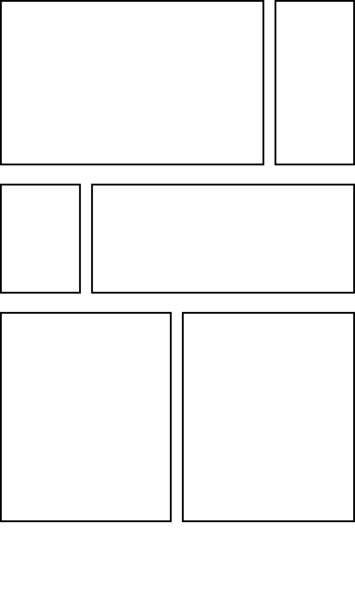
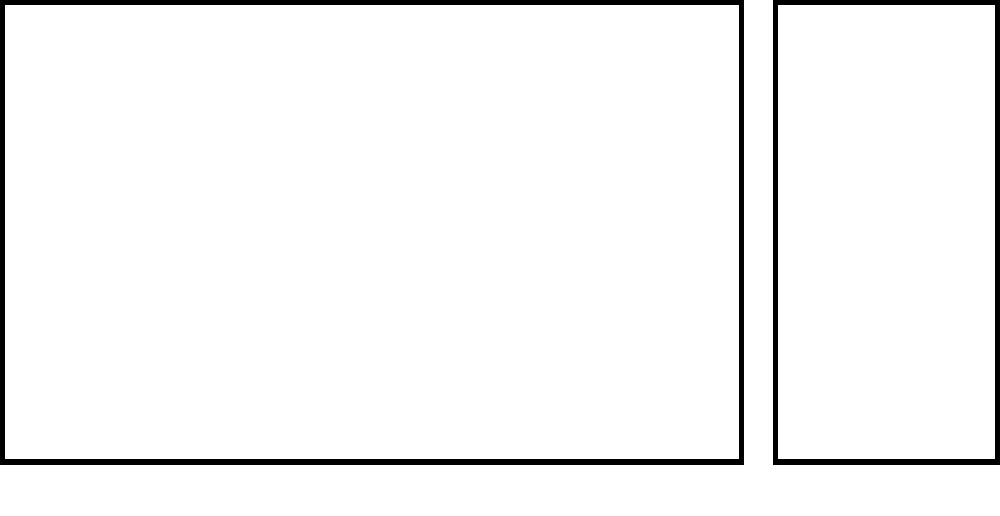
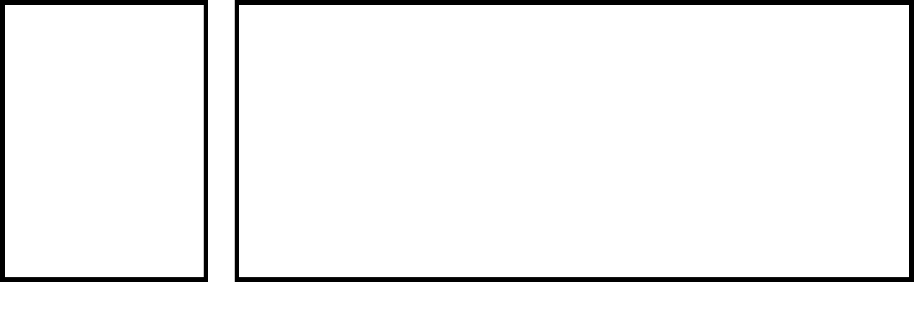
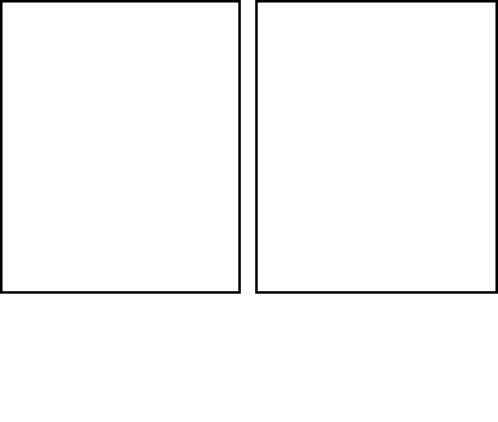

てすと一覧  

[Markdown記法 チートシート](https://gist.github.com/mignonstyle/083c9e1651d7734f84c99b8cf49d57fa)  
[Markdown記法 チートシート](https://gist.github.com/mignonstyle/083c9e1651d7734f84c99b8cf49d57fa)  
[Markdown記法 チートシート](https://gist.github.com/mignonstyle/083c9e1651d7734f84c99b8cf49d57fa)  

てすと
1. [なんとか](https://gist.github.com/mignonstyle/083c9e1651d7734f84c99b8cf49d57fa)  
2. [なんとかだよ](https://gist.github.com/mignonstyle/083c9e1651d7734f84c99b8cf49d57fa)  
3. [な](https://gist.github.com/mignonstyle/083c9e1651d7734f84c99b8cf49d57fa)  

[Markdown記法 チートシート](https://gist.github.com/mignonstyle/083c9e1651d7734f84c99b8cf49d57fa)  
[Markdown記法 チートシート](https://gist.github.com/mignonstyle/083c9e1651d7734f84c99b8cf49d57fa)  




  



う

<script>
  window.onload = function onLoad(){
  var character_1 = ["怒れる若者", "アンチ・ヒーロー", "観客", "ほら吹き", "男役", "さくら", "腹心", "批評家", "女役", "ヒーロー/ヒロイン", "王", "無礼講の王", "恋人", "吟遊詩人", "老人役/老女役", "劇作家", "犠牲", "悪党", "料理人", "賢者", "敵役", "医者", "道化"];
  var character_1_random = Math.floor(Math.random() * character_1.length);
  target_character_1 = document.getElementById("character_1_id");
  target_character_1.innerHTML = character_1[character_1_random];
  }
</script>

<div id="character_1_id"></div>

てすと  

<!-- Accent-colored raised button with ripple -->
[<button class="mdl-button mdl-js-button mdl-button--raised mdl-js-ripple-effect mdl-button--accent">
  Button
</button>](https://gist.github.com/mignonstyle/083c9e1651d7734f84c99b8cf49d57fa)    
<!-- Raised button with ripple -->
<button class="mdl-button mdl-js-button mdl-button--raised mdl-js-ripple-effect">
  Button
</button>  
<!-- Raised disabled button -->
<button class="mdl-button mdl-js-button mdl-button--raised" disabled>
  Button
</button>  

ぼたんてすと  

[Markdown記法 チートシート](https://gist.github.com/mignonstyle/083c9e1651d7734f84c99b8cf49d57fa)  

Text can be **bold**, _italic_, or ~~strikethrough~~.

[Link to another page](./another-page.html).

There should be whitespace between paragraphs.

There should be whitespace between paragraphs. We recommend including a README, or a file with information about your project.

# Header 1

This is a normal paragraph following a header. GitHub is a code hosting platform for version control and collaboration. It lets you and others work together on projects from anywhere.

## Header 2

> This is a blockquote following a header.
>
> When something is important enough, you do it even if the odds are not in your favor.

### Header 3

```js
// Javascript code with syntax highlighting.
var fun = function lang(l) {
  dateformat.i18n = require('./lang/' + l)
  return true;
}
```

```ruby
# Ruby code with syntax highlighting
GitHubPages::Dependencies.gems.each do |gem, version|
  s.add_dependency(gem, "= #{version}")
end
```

#### Header 4

*   This is an unordered list following a header.
*   This is an unordered list following a header.
*   This is an unordered list following a header.

##### Header 5

1.  This is an ordered list following a header.
2.  This is an ordered list following a header.
3.  This is an ordered list following a header.

###### Header 6

| head1        | head two          | three |
|:-------------|:------------------|:------|
| ok           | good swedish fish | nice  |
| out of stock | good and plenty   | nice  |
| ok           | good `oreos`      | hmm   |
| ok           | good `zoute` drop | yumm  |

### There's a horizontal rule below this.

* * *

### Here is an unordered list:

*   Item foo
*   Item bar
*   Item baz
*   Item zip

### And an ordered list:

1.  Item one
1.  Item two
1.  Item three
1.  Item four

### And a nested list:

- level 1 item
  - level 2 item
  - level 2 item
    - level 3 item
    - level 3 item
- level 1 item
  - level 2 item
  - level 2 item
  - level 2 item
- level 1 item
  - level 2 item
  - level 2 item
- level 1 item

### Small image


### Large image


### Definition lists can be used with HTML syntax.

<dl>
<dt>Name</dt>
<dd>Godzilla</dd>
<dt>Born</dt>
<dd>1952</dd>
<dt>Birthplace</dt>
<dd>Japan</dd>
<dt>Color</dt>
<dd>Green</dd>
</dl>

```
Long, single-line code blocks should not wrap. They should horizontally scroll if they are too long. This line should be long enough to demonstrate this.
```

```
The final element.
```
